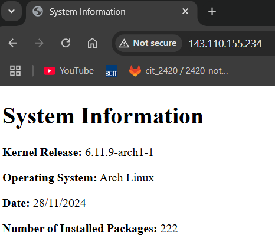

# Utlizing nginx and Services to Deploy Web Pages
In this tutorial I will go over the basics of systemd services and timers, nginx, and ufw. Using these tools we will be deploying a web page that is created from a script run by a service and timer.

# Step 1: Creating a System User
We will start by creating a system user named `webgen`, their home directory will be set to `/var/lib/webgen`, and we will also give them a specific login shell for system users.

Start by running the following command:
`sudo useradd --system -s /usr/bin/nologin -d /var/lib/webgen webgen`

- `--system` specifies that we are creating a system user.
- `-s /usr/bin/nologin` specifies the login shell to give this user.
- `-d /var/lib/webgen` specifies the users home directory, and creates the directory should it not exist.
- `webgen` is simply the new user's name.

Sometimes the -d command does not create the home directory for the user. Check if the directory was creating using `ls /var/lib/webgen`, you will get an error if it does not exist. If it wasn't created simply run `sudo mkdir /var/lib/webgen`.

Now lets add some directories and files to webgen's home. Run the following commands:

`sudo mkdir /var/lib/webgen/bin`
`sudo mkdir /var/lib/webgen/HTML`
`sudo touch /var/lib/webgen/bin/generate_index`
`sudo touch /var/lib/webgen/HTML/index.html`

Your directory structure should now look like this:
```
/var/lib/webgen/
|-- bin/
|    |-- generate_index
|
|-- HTML/
     |-- index.html
```

Open the generate_index file using `sudo nvim /var/lib/webgen/bin/generate_index` and paste in the following script:
```
#!/bin/bash

set -euo pipefail

# this is the generate_index script
# you shouldn't have to edit this script

# Variables
KERNEL_RELEASE=$(uname -r)
OS_NAME=$(grep '^PRETTY_NAME' /etc/os-release | cut -d '=' -f2 | tr -d '"')
DATE=$(date +"%d/%m/%Y")
PACKAGE_COUNT=$(pacman -Q | wc -l)
OUTPUT_DIR="/var/lib/webgen/HTML"
OUTPUT_FILE="$OUTPUT_DIR/index.html"

# Ensure the target directory exists
if [[ ! -d "$OUTPUT_DIR" ]]; then
    echo "Error: Failed to create or access directory $OUTPUT_DIR." >&2
    exit 1
fi

# Create the index.html file
cat <<EOF > "$OUTPUT_FILE"
<!DOCTYPE html>
<html lang="en">
<head>
    <meta charset="UTF-8">
    <meta name="viewport" content="width=device-width, initial-scale=1.0">
    <title>System Information</title>
</head>
<body>
    <h1>System Information</h1>
    <p><strong>Kernel Release:</strong> $KERNEL_RELEASE</p>
    <p><strong>Operating System:</strong> $OS_NAME</p>
    <p><strong>Date:</strong> $DATE</p>
    <p><strong>Number of Installed Packages:</strong> $PACKAGE_COUNT</p>
</body>
</html>
EOF

# Check if the file was created successfully
if [ $? -eq 0 ]; then
    echo "Success: File created at $OUTPUT_FILE."
else
    echo "Error: Failed to create the file at $OUTPUT_FILE." >&2
    exit 1
fi
```

This script will generate an index.html file with your system information when it's run.

Lastly we need to ensure the permissions on our users files are correct. Run the following scripts to edit the permissions:
`sudo chown -R webgen:webgen /var/lib/webgen`
`sudo chmod +x /var/lib/webgen/bin/generate_index`

- `chown -R webgen:webgen` will cause all subdirectories of `/var/lib/webgen` including that directory to be owned by webgen and the group webgen.
- `chmod +x` will allow `~/bin/generate_index` to be executed as a bash script.

# Step 2: Creating Service and Timer Files
Here we will need to create a service file and a timer file so that our `generate_index` script gets run at 05:00 every day.

Lets start with the service file. Type `sudo nvim /etc/systemd/system/generate-index.service` and then insert the following:

```
[Unit]
Description=Runs the generate-index script.
Wants=network-online.target
After=network-online.target

[Service]
ExecStart=/var/lib/webgen/bin/generate_index
User=webgen
Group=webgen
```

- `Wants` and `After` specify that our service `wants` (option dependency) network-online.target to be running and we will run our unit `After`.
- `ExecStart` specifies the script to be run.
- `User` and `Group` specifies the user and group.

Now lets create our timer file. Type `sudo /etc/systemd/system/generate-index.timer` and insert the following:

```
[Unit]
Description=Run generate-index every dat at 05:00.

[Timer]
OnCalendar=*-*-* 05:00:00
Persistent=true

[Install]
WantedBy=timers.target
```

- `OnCalendar` will run the service every day at 5am UTC.
- `Persistent` when set to `true` will trigger the service immediately if it missed the last start time.
- `WantedBy` targetting `timers.target` ensures that the timer is activated after boot so long as the timer is enabled.

Now all we need to do is enable our timer with the following command:
`sudo systemctl enable --now generate-index.timer`

Using the `--now` option will also start the timer.

Note: If you need to check on your services at any point you can use the `sudo systemctl status <service-name>` command, it should output any errors should something be wrong. Running this command will also ensure that our service is active and working.

Additionally if you edit a service file be sure to restart it and run `sudo systemctl daemon-reload` to commit the changes before running again.

# Step 3: Setting up nginx to Deploy a Site
In this step we will be configuring our nginx to deploy our index.html site. If you don't already have it, type `sudo pacman -S nginx` to install nginx.

Note: If nginx fails to install through pacman, try updating your system with `sudo pacman -Syu` and then rebooting with `reboot`. It should work afterwards.

Now we're ready to edit our nginx config file. The only information we need to put in this main config is the name of our server user and to include server blocks found within `/etc/nginx/sites-enabled/` Type `sudo nvim /etc/nginx/nginx.conf` to edit the config.

Add the following lines where they are seen in the config below them:
```
user webgen;
include /etc/nginx/sites-enabled/*;
```

```
user webgen; # ADD THIS LINE
worker_processes  1;

#error_log  logs/error.log;
#error_log  logs/error.log  notice;
#error_log  logs/error.log  info;

#pid        logs/nginx.pid;


events {
    worker_connections  1024;
}


http {
    types_hash_max_size 4096;
    types_hash_bucket_size 64;
    include       mime.types;
    include /etc/nginx/sites-enabled/*; # ADD THIS LINE
    default_type  application/octet-stream;
# MORE LINES BELOW ...
```

Now we want to create a separate server block file that will allow nginx to deploy index.html through port 80. We dont want to add this block to the main `nginx.conf` since we could run into issues if we have multiple sites running in the future and they're all in the same file. By creating separate blocks we can enable and disable specific sites and maintain them with more ease.

With that being said lets create the required directories for our server block:
`sudo mkdir /etc/nginx/sites-available`
`sudo mkdir /etc/nginx/sites-enabled`

Now we can write the server block. Type `sudo nvim /etc/nginx/sites-available/webgen.conf` and insert the following script:
```
server {
        listen 80; # Server listening through port 80
        listen [::]:80; # ipv6 address

        server_name _; # server name '_' indicates default name.

        root /var/lib/webgen/HTML; # Root directory for our html files
        index index.html; # index html file within the root dir

                location / { # When routed to index do the following:
                try_files $uri $uri/ =404; # try matching files, if nothing found error 404
        }
}
```

Now that that's done we just need to create a symbolic link from the sites-enabled directory to our config:
`sudo ln -s /etc/nginx/sites-available/webgen.conf /etc/nginx/sites-enabled/webgen.conf`

After that just enable your nginx process using `sudo systemctl enable --now nginx`

Note: I encountered an error when running `sudo systemctl status nginx` which directed me to increase the `types_hash_max_size` and `types_hash_bucket_size`. You can skip to step 4 if you do not encounter an error relating to these values:

Reopen your nginx config `sudo nvim /etc/nginx/nginx.conf` and paste in the following lines at the top of the `http` function:

```
types_hash_max_size 4096;
types_hash_bucket_size 64;
```

Your file should then look something like this:
```
http{
    types_hash_max_size 4096;
    types_hash_bucket_size 64;
    include     mime.types;
    include /etc/nginx/sites-enabled/*;

    # MORE LINES BELOW...
```

# Step 4: Setting up a Firewall
Now that our server is setup we should setup a firewall to ensure we're protected. It's best practice to start by allowing nothing incoming and allowing everything outgoing with a firewall, from there we will just tweak what is necessary for maximum protection.

If you don't have it installed, start by installing ufw:
`sudo pacman -S ufw`

WARNING: DO NOT enable your firewall before allowing ssh if you have denied all incoming traffic. Doing so will disable you from accessing your droplet entirely and you may need to create a new one.

By default the firewall is not enabled, we will enable it after inputting the following commands to change the firewall settings:
```
sudo ufw default deny incoming # Denies all incoming traffic
sudo ufw default allow outgoing # Allowing all outgoing traffic
sudo ufw allow ssh # Allows incoming ssh traffic
sudo ufw allow hhtp # Allows incoming http traffic
```

To check the list of allowed apps we can use `sudo ufw app list`. You should see http and ssh somewhere on here.

ENSURE YOU HAVE ENABLED SSH BEFORE PROCEEDING. Afterwards you can use `sudo ufw enable` to enable your firewall.

Once you've completed all these steps you should be able to force the service to start by using `sudo systemctl start generate-index.service` and then typing your ip address into a browser.

Tip: You can get your ip address by using `ip -4 addr` and it should be under `eth0`.



Note: If you type in your ip address and it auto completes in the url line it may try to connect via https. We have no allowed https so in that case you will not be able to access your site.

# Step 5: Improving our site
Our site contains some pretty rudimentary information about our system. Here we will make an attempt to add some more information to our site.

First lets install the package `inxi` as it will allow us to output a bunch of system hardware information using a single package and simply:
`sudo pacman -S inxi`

Next we will be adding the following commands to our script:
- `inxi --cpu` returns information about the system's CPU.
- `inxi --disk` returns information about the system's storage.
- `inxi -G` returns information about the system's GPU.
- `inxi --memory` returns information about the system's memory.
- `inxi --weather` returns information about the weather where the system locale is set.

Open up your script using `sudo nvim /var/lib/webgen/bin/generate_index` and edit it to include the commands we just looked at:

```
#!/bin/bash

set -euo pipefail

# this is the generate_index script
# you shouldn't have to edit this script

# Variables
KERNEL_RELEASE=$(uname -r)
OS_NAME=$(grep '^PRETTY_NAME' /etc/os-release | cut -d '=' -f2 | tr -d '"')
DATE=$(date +"%d/%m/%Y")
PACKAGE_COUNT=$(pacman -Q | wc -l)
CPU=$(inxi --cpu)
GPU=$(inxi -G)
HDD=$(inxi --disk)
MEM=$(inxi --memory)
WEATHER=$(inxi --weather)
OUTPUT_DIR="/var/lib/webgen/HTML"
OUTPUT_FILE="$OUTPUT_DIR/index.html"

# Ensure the target directory exists
if [[ ! -d "$OUTPUT_DIR" ]]; then
    echo "Error: Failed to create or access directory $OUTPUT_DIR." >&2
    exit 1
fi

# Create the index.html file
cat <<EOF > "$OUTPUT_FILE"
<!DOCTYPE html>
<html lang="en">
<head>
    <meta charset="UTF-8">
    <meta name="viewport" content="width=device-width, initial-scale=1.0">
    <title>System Information</title>
</head>
<body>
    <h1>System Information</h1>
    <p><strong>Kernel Release:</strong> $KERNEL_RELEASE</p>
    <p><strong>Operating System:</strong> $OS_NAME</p>
    <p><strong>Date:</strong> $DATE</p>
    <p><strong>Number of Installed Packages:</strong> $PACKAGE_COUNT</p>
    <p><strong>CPU:</strong></p>
    <p>$CPU</p>
    <p><strong>GPU:</strong></p>
    <p>$GPU</p>
    <p><strong>Memory:</strong></p>
    <p>$MEM</p>
    <p><strong>Storage:</strong></p>
    <p>$HDD</p>
    <p><strong>Weather at server location:</strong></p>
    <p>$WEATHER</p>
</body>
</html>
EOF

# Check if the file was created successfully
if [ $? -eq 0 ]; then
    echo "Success: File created at $OUTPUT_FILE."
else
    echo "Error: Failed to create the file at $OUTPUT_FILE." >&2
    exit 1
fi
```

Now all you should need to do is run `sudo systemctl start generate-index.service` and refresh your webpage. The results should look like this:


It's not perfect and a lot of the formatting seems to break but we can still get a lot of information out of here including the weather!

# References

1. (https://wiki.archlinux.org/title/Systemd/Timers)
2. (https://nginx.org/en/docs/http/ngx_http_core_module.html)
3. (https://man.archlinux.org/man/systemd.special.7)
4. (https://wiki.archlinux.org/title/Nginx)
5. (https://wiki.archlinux.org/title/File_permissions_and_attributes)
6. (https://nginx.org/en/docs/beginners_guide.html)
7. (https://man.archlinux.org/man/systemd.syntax.7.en)
8. (https://man.archlinux.org/man/systemd.exec.5.en)
9. (https://man.archlinux.org/man/systemd.unit.5.en)
10. (https://man.archlinux.org/man/useradd.8)
11. (https://man.archlinux.org/man/extra/inxi/inxi.1.en)